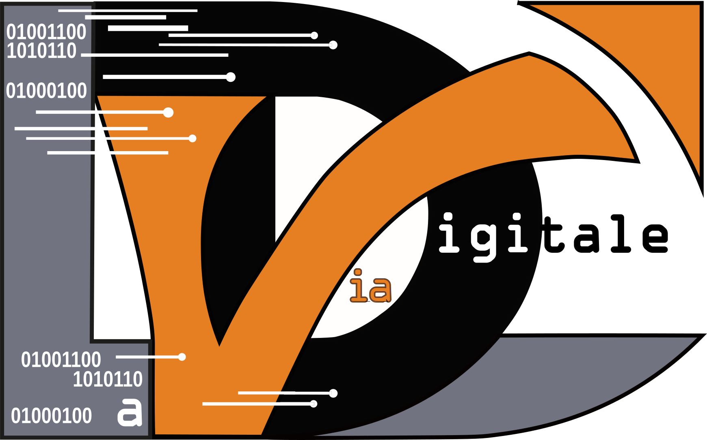

  

<h1 align="center">La Via Digitale</h1>

  Chef de projet digital • Product owner • applications web • outils métier

  Je transforme des besoins métier en solutions digitales concrètes, utiles et utilisables.

---

## Qui je suis

Je pilote des projets digitaux avec une double casquette : produit et technique.

Concrètement, j’aide à :
- clarifier un besoin
- cadrer ce qui a vraiment de la valeur
- transformer cela en solution compréhensible par le métier et réalisable par la technique
- faire avancer le projet sans en faire un feuilleton de 12 saisons

Je travaille sur des applications web, des outils métier, des parcours digitaux et des sujets de structuration produit.

## Ce que je fais

- cadrage fonctionnel
- product ownership
- pilotage de projet
- priorisation de backlog
- conception d’outils et de parcours digitaux
- coordination entre métier, produit et technique
- amélioration continue

## Ma façon de travailler

J’aime les projets :
- utiles avant d’être “wahou”
- simples avant d’être compliqués
- lisibles avant d’être brillants
- livrés avant d’être éternellement “presque prêts”

Mon objectif n’est pas de produire plus de slides.
Mon objectif est de faire avancer un produit, une équipe et un besoin réel.

## Ce que vous trouverez ici

Une partie de mes projets reste privée pour des raisons de confidentialité.

Donc sur ce profil GitHub, vous trouverez surtout :
- mon univers de travail
- quelques expérimentations
- des bases, templates ou démonstrateurs publics
- une manière de travailler
- un aperçu de ma stack

En revanche, vous ne trouverez pas ici l’intégralité de mes projets clients.
J’aime la transparence, mais j’aime aussi éviter les réunions juridiques inutiles.

## Terrains de jeu

Je travaille notamment sur :
- les applications métier
- la digitalisation de processus
- les outils internes
- les espaces clients
- les produits SaaS
- les interfaces simples pour des sujets complexes

## Stack et environnement

Selon les projets, j’utilise notamment :

- HTML / CSS / JavaScript
- TypeScript
- React
- Next.js
- Supabase
- PostgreSQL
- GitHub
- Vercel

Et côté produit / projet :
- backlog
- user stories
- cadrage fonctionnel
- recette
- priorisation
- coordination métier / technique

## Ce qui m’intéresse

J’aime les sujets où il faut :
- remettre de la clarté
- éviter la surcomplexité
- construire quelque chose d’utile
- faire parler ensemble le métier et la technique
- transformer une idée floue en solution concrète

## En ce moment

Je développe et pilote différents sujets autour :
- des applications web
- des outils métier
- des produits digitaux
- des expérimentations menées via La Via Digitale

## Me contacter

- site : [laviadigitale.fr](https://laviadigitale.fr)
- LinkedIn : (https://www.linkedin.com/in/michael-pommerat)

---

  Faire simple est un vrai travail.

